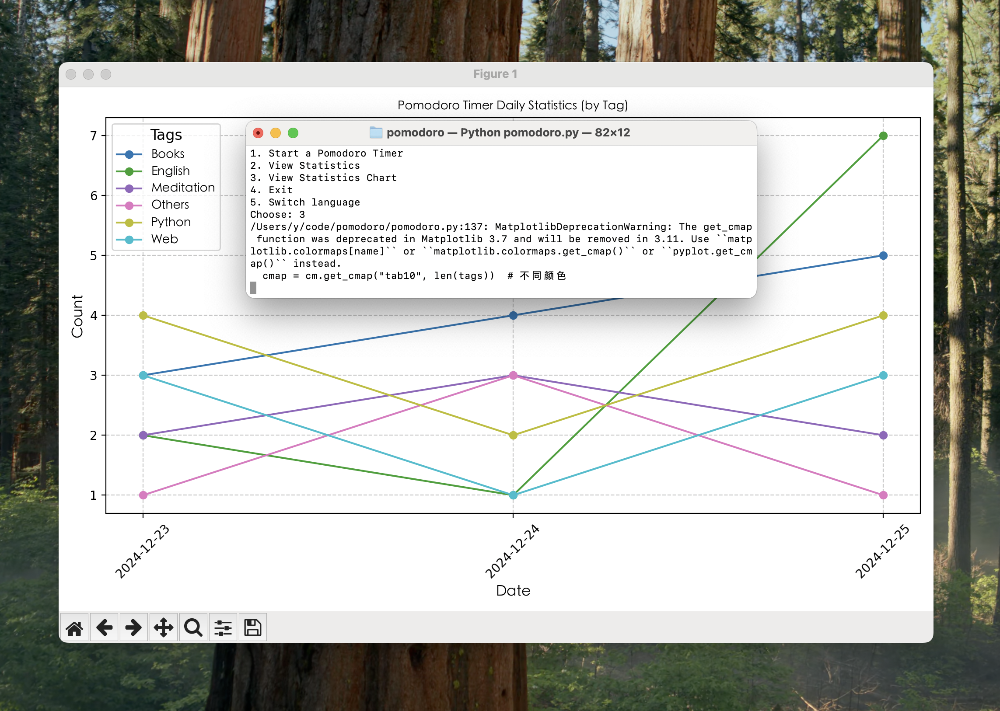

# Pomodoro Timer with Statistics and Tagging

[中文版本 README available here](README.zh.md)

This is a Pomodoro timer application that tracks your productivity over time. It allows you to set a timer for a specific task, categorize tasks with custom tags, and view daily statistics in a table or graphical format. The application supports multiple languages and includes backup functionality.

## Features
- Start a Pomodoro timer with customizable duration and task tag.
- Plays a notification sound upon completing a Pomodoro session.
- View daily Pomodoro count statistics, categorized by tags.
- Display daily Pomodoro statistics as a line chart.
- Add custom tags for better task management.
- Support for English and Chinese (Simplified) languages.
- The data will be saved to the `pomodoro_data_with_tags.json` file, and a backup file `pomodoro_data_backup.json` will be generated.


## Requirements
- Python 3.x
- `matplotlib` library for generating charts.
- macOS, Windows, or Linux ([ensure you have proper font settings for your system](#language-support)).

## Installation

1. Clone the repository:
   ```bash
   git clone https://github.com/yzwbeast/pomodoro.git
   ```
2. Navigate to the project directory:
   ```bash
   cd pomodoro
   ```
<details>
<summary>Why Use Virtual Environments</summary>

> When you encounter the "**externally-managed-environment**" error, it might be because the Python version installed via APT by the operating system enforces strict management of the system environment, preventing users from modifying system-level Python packages with pip.<br />
> **Recommended Solution**:<br />Using a virtual environment is the cleanest and safest method. It does not affect the system Python environment and allows you to freely manage dependencies.
</details>

3. Create a virtual environment<br />Run in the project directory:
   ```bash
   python3 -m venv timer
   ```
   - `timer` is the name of the virtual environment and can be replaced with any name.
4. Activate the virtual environment:
   ```bash
   source timer/bin/activate
   ```
5. Install the required dependencies:
    ```bash
    pip install matplotlib
    ```
6. Run the script:
    ```bash
    python pomodoro.py
    ```
7. Exit the virtual environment: After use, you can exit the environment:
   ```bash
   deactivate
   ```
8. Delete the virtual environment
Just delete the my_env folder:
   ```bash
   rm -rf timer
   ```

## Usage

When you run the program, you'll be presented with a menu of options:
1. **Start a Pomodoro Timer**: Set a timer with a specific duration and a task tag.
2. **View Statistics**: View a summary of the daily Pomodoro count, categorized by tags.
3. **View Statistics Chart**: See a line chart visualizing your Pomodoro sessions over time.
4. **Add New Tag**: Add a custom tag for your tasks.
5. **Exit**: Exit the application.
6. **Switch Language**: Switch between English and Chinese (Simplified).

## Language Support

- **English**: Default language.
- **Chinese (Simplified)**: To switch to Chinese, select the language option in the menu.

   ```bash
    font_path = "/System/Library/Fonts/STHeiti Light.ttc"  # macOS 
    # font_path = "/usr/share/fonts/truetype/dejavu/DejaVuSans.ttf"  # Ubuntu 
    # font_path = "C:/Windows/Fonts/simhei.ttf"  # Windows 
   ```


## File Format

- **pomodoro_data_with_tags.json**: Stores your Pomodoro session data in JSON format.
- **pomodoro_data_backup.json**: Backup of the session data.

## License

This project is licensed under the MIT License - see the [LICENSE](LICENSE) file for details.

[中文版本 README available here](README.zh.md)
