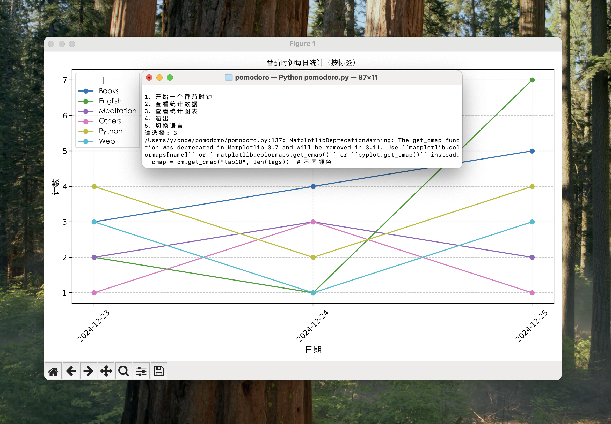

# 番茄时钟计时器（带统计和标签功能）

[English README available here](README.md)

这是一个番茄时钟应用程序，能够跟踪你的工作效率。它允许你为每个任务设置番茄时钟，使用自定义标签对任务进行分类，并以表格或图表的形式查看每日统计数据。该应用支持多语言，并包括数据备份功能。

## 特性
- 启动番茄时钟，设置自定义时长和任务标签。
- 计时提醒：番茄时钟完成后发出提示音。
- 查看每日番茄时钟统计数据，按标签分类。
- 以折线图显示每日番茄时钟统计数据。
- 添加自定义标签来更好地管理任务。
- 支持英语和简体中文。
- 数据将保存到 `pomodoro_data_with_tags.json` 文件中，并生成备份文件 `pomodoro_data_backup.json`。


## 需求
- Python 3.x
- `matplotlib` 库用于生成图表。
- 支持 macOS、Windows 或 Linux（[请确保根据您的系统设置正确的字体](#语言支持)）。

## 安装

1. 克隆仓库：
   ```bash
   git clone https://github.com/yzwbeast/pomodoro.git
   ```
2. 进入项目目录：
   ```bash
   cd pomodoro
   ```

<details>
<summary>为什么推荐使用虚拟环境</summary>

>当你遇到 “**externally-managed-environment**” 错误时，可能是操作系统 使用 APT 安装的 Python 版本对系统环境进行了严格管理，防止用户通过 pip 修改系统级的 Python 包。<br />
>要解决这个问题，**推荐方法**：<br />使用虚拟环境是最干净、安全的方法。它不会影响系统的 Python 环境，同时方便你自由管理依赖。
</details>

3. 创建虚拟环境<br />在项目目录下运行：
   ```bash
   python3 -m venv timer
   ```
   - `timer` 是虚拟环境的名称，可以替换为任意名字。
4. 激活虚拟环境：
   ```bash
   source timer/bin/activate
   ```
5. 安装所需的依赖项：
    ```bash
    pip install matplotlib
    ```
6. 运行脚本：
    ```bash
    python pomodoro.py
    ```
7. 退出虚拟环境：使用完后，可退出环境：
   ```bash
   deactivate 
   ```
8. 删除虚拟环境
直接删除 my_env 文件夹即可：
   ```bash
   rm -rf timer
   ```

## 使用

运行程序后，你将看到一个菜单选项：
1. **开始一个番茄时钟**：设置任务标签和番茄时钟时长。
2. **查看统计数据**：查看每日按标签分类的番茄时钟数量。
3. **查看统计图表**：查看折线图，展示你的番茄时钟记录。
4. **添加新标签**：为任务添加新的标签。
5. **退出**：退出应用程序。
6. **切换语言**：切换语言为英语或简体中文。

## 语言支持

- **英语**：默认语言。
- **简体中文**：在菜单中选择切换语言为中文。

   ```bash
    font_path = "/System/Library/Fonts/STHeiti Light.ttc"  # macOS 示例
    # font_path = "/usr/share/fonts/truetype/dejavu/DejaVuSans.ttf"  # Ubuntu 示例
    # font_path = "C:/Windows/Fonts/simhei.ttf"  # Windows 示例
   ```

## 文件格式

- **pomodoro_data_with_tags.json**：以 JSON 格式存储番茄时钟的会话数据。
- **pomodoro_data_backup.json**：番茄时钟会话数据的备份。

## 许可证

本项目采用 MIT 许可证 - 请查看 [LICENSE](LICENSE) 文件了解详情。

[English README available here](README.md)